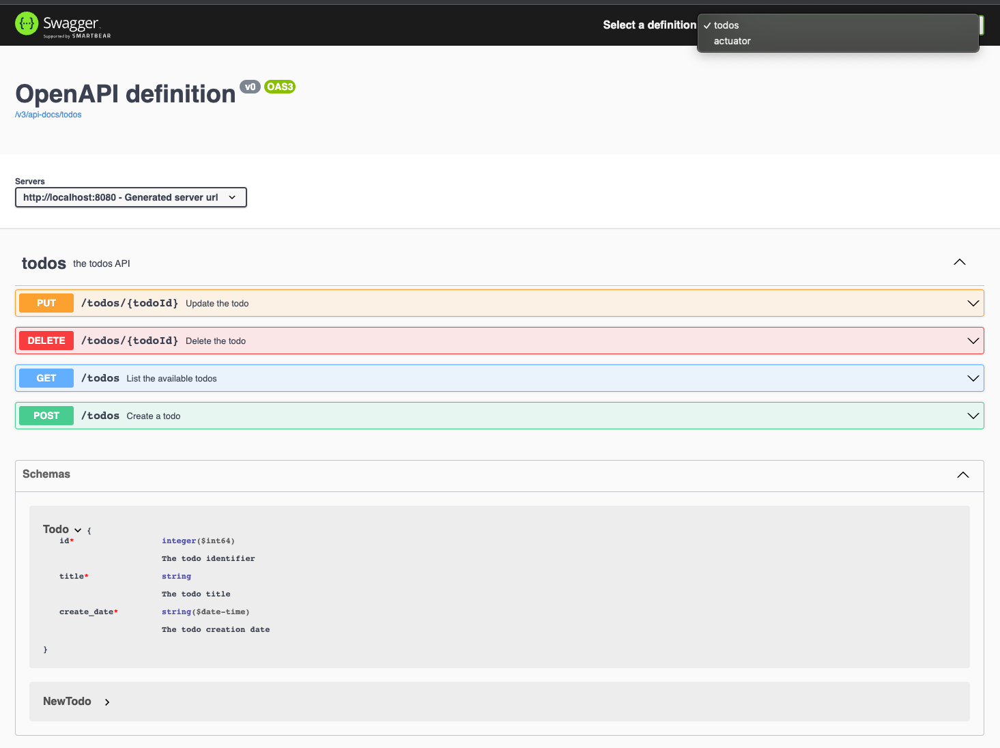

# Api First Design - Spring Boot demo

This repository demonstrates an api first approach of building simple `Todo Service`.

Contract first means that we're developing a specification before we begin implementing our service.

## Features

* Api First Design
* OpenAPI 3.0
* OpenAPI Generator
* Swagger UI
* Grouped APIs in SwaggerUI

## Getting Started

### Prerequisites:

* Java 11

### Usage:

1. Check **Todo Service** OpenAPI specification. Open [src/main/resources/api.yml](./src/main/resources/api.yml)
2. Generate Spring controllers and models from the specification using Gradle plugin
    ```shell
    ./gradlew openApiGenerate
    ```
3. Investigate generated models and controllers interfaces under `build/generated/sources/src/main/java` directory
4. Check [TodoController](./src/main/java/com/rbiedrawa/app/controllers/TodoController.java) implementation
5. Add new endpoint or model to the service
   1. Update OpenAPI spec in [api.yml](./src/main/resources/api.yml)
   2. Generate the new models or controllers by running again`./gradlew openApiGenerate`
   3. Implement any new features 
6. Start **Todo Service**
   ```shell
   ./gradlew bootRun
   ```
7. Open [Swagger UI](http://localhost:8080/swagger-ui.html) page and play with API 😉
   

## Useful tools

* [Swagger Editor](https://editor.swagger.io/)
* [IntelliJ - OpenAPI](https://www.jetbrains.com/help/idea/openapi.html)
* [OpenAPI (Swagger) Editor - IntelliJ Plugin](https://plugins.jetbrains.com/plugin/14837-openapi-swagger-editor)

## References

For further reference, please consider the following sections:

* [Understanding API-First Development](https://tanzu.vmware.com/developer/guides/api-first-development/)
* [Bringing together OpenAPI 3 and Spring Boot](https://www.youtube.com/watch?v=utRxyPfFlDw)

## License

Distributed under the MIT License. See `LICENSE` for more information.
